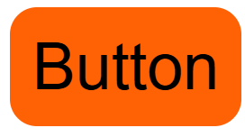
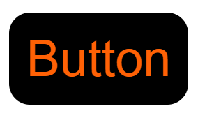
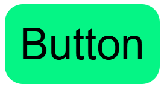
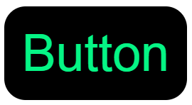

# ButtonThemes
Contains themes for styling buttons.    
Removes the pain of button Styling!!

### Themes     
There are two themes available (Will add more themes soon):

#### buttonTheme1:
This theme has a background color of orange and text color of black, by default.    
When hovering over the button, the color of the text and the background colors flip,                                        
Meaning that the background color becomes black and the color becomes orange.                                 
Below are the images for non-hover and hover effects respectively:    
     
                                                                         
                                          
#### buttonTheme2:                                                                                 
This theme has a background color of bright green and text color of black, by default.                
When hovering over the button, the color of the text and the background colors flip,                                                
Meaning that the background color becomes black and the color becomes bright green.
Below are the images for non-hover and hover effects respectively:   
     
                                                                         
